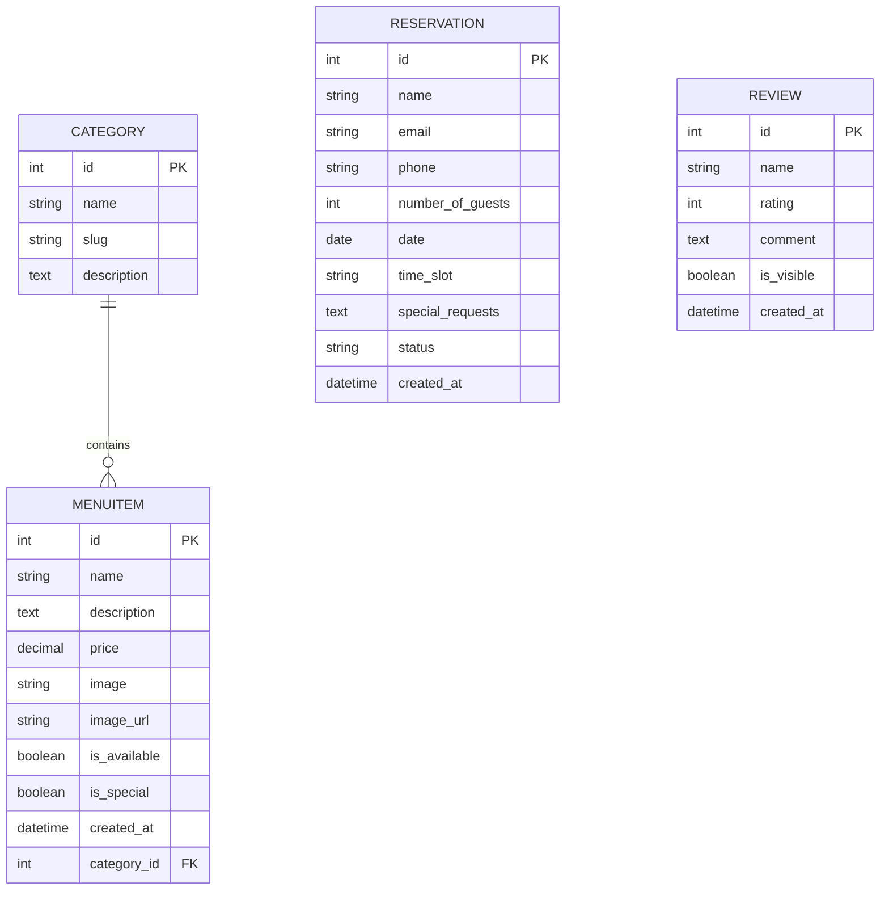

# Taste Haven - Academic Project Report

**Project Title:** Taste Haven - Premium Restaurant Website & Table Booking System  
**Course Name:** Master of Computer Applications (MCA)  
**Assigned Technology:** Python & Django (Web Framework)  
**Database:** SQLite3 (Django Default)  

---

## 1. Executive Summary
**Taste Haven** is a web-based reservation and menu management system designed specifically for a premium dining restaurant. The application serves two main actors:
1. **Guests/Customers:** Can view an elegant, animated home page, explore categorized menu items (appetizers, main courses, desserts, beverages), submit table reservations with automated capacity validation, and leave reviews.
2. **Restaurant Staff/Administrators:** Can track reservations (today's schedule, upcoming events, past bookings), view statistics on reservations and reviews, manage menu listings, and approve/cancel bookings.

The project is built on the Model-View-Template (MVT) architecture of **Django**, utilizing custom CSS and JavaScript to provide a premium user experience without heavy dependencies.

---

## 2. System Requirement Specification (SRS)

### 2.1 Software Requirements
* **Operating System:** Windows 10/11, macOS, or Linux
* **Programming Language:** Python (v3.10 or higher)
* **Framework:** Django (v6.0 or higher)
* **Image Processing Library:** Pillow (v10.0 or higher - required for ImageFields)
* **Web Browser:** Google Chrome, Firefox, Safari, Microsoft Edge

### 2.2 Hardware Requirements
* **Processor:** Intel Core i3 / AMD Ryzen 3 or higher
* **Memory:** Minimum 4 GB RAM (8 GB recommended)
* **Disk Space:** 500 MB free space (for media/database storage)

---

## 3. System Architecture & Database Design

The project uses Django's default ORM to interface with an SQLite database. It consists of four relational tables:



### 3.1 Model Schema Definitions
1. **Category:** Categorizes dishes (e.g., Appetizers, Main Course). Standardizes URL filtering using unique slugs.
2. **MenuItem:** Stores food attributes. Features double-image loading (local upload with fallback URL). Features `is_special` for homepage spotlights.
3. **Reservation:** Custom clean method validates date correctness (no booking in the past) and handles safety capacity limits (max 50 guests per time slot).
4. **Review:** Holds guest comments and star ratings (1 to 5). Toggled visibility determines if reviews display on the homepage slider.

---

## 4. Separation of Backend and Frontend

To align with the developer guidelines, the system maintains a strict separation between backend business logic and frontend styling.

### 4.1 Backend Components (Python/Django)
The backend manages data structures, inputs validation, route routing, and controller execution:
* [models.py](file:///C:/Users/bhavy/.gemini/antigravity/scratch/taste_haven/restaurant/models.py): Defines the database schema, data integrity validators, and business validation constraints.
* [views.py](file:///C:/Users/bhavy/.gemini/antigravity/scratch/taste_haven/restaurant/views.py): Executes application logic, query database objects, handles form submissions, and directs context arrays.
* [forms.py](file:///C:/Users/bhavy/.gemini/antigravity/scratch/taste_haven/restaurant/forms.py): Form generation mapped directly from models, injecting CSS wrappers and HTML validations.
* [urls.py](file:///C:/Users/bhavy/.gemini/antigravity/scratch/taste_haven/restaurant/restaurant/urls.py): App-level routes mapping URLs to views.

### 4.2 Frontend Components (HTML/CSS/JS)
The frontend handles visual aesthetics and client-side interactions:
* **Templates** (`templates/restaurant/`): HTML5 files defining structure. Uses Django Template Language (DTL) for loops, conditionals, and variables injection:
  * [base.html](file:///C:/Users/bhavy/.gemini/antigravity/scratch/taste_haven/restaurant/templates/restaurant/base.html): Defines master layout, navbar, notification alerts, and footer.
  * [home.html](file:///C:/Users/bhavy/.gemini/antigravity/scratch/taste_haven/restaurant/templates/restaurant/home.html): Renders hero banners, about section with custom vector art, chef's specials, reviews list, and feedback form.
  * [menu.html](file:///C:/Users/bhavy/.gemini/antigravity/scratch/taste_haven/restaurant/templates/restaurant/menu.html): Renders dishes filter tabs and cards.
  * [book.html](file:///C:/Users/bhavy/.gemini/antigravity/scratch/taste_haven/restaurant/templates/restaurant/book.html): Reservation form and booking success ticket card.
  * [dashboard.html](file:///C:/Users/bhavy/.gemini/antigravity/scratch/taste_haven/restaurant/templates/restaurant/dashboard.html): Visual summary panels and reservations lists.
* **Static Assets** (`static/restaurant/`):
  * [style.css](file:///C:/Users/bhavy/.gemini/antigravity/scratch/taste_haven/restaurant/static/restaurant/css/style.css): Global style sheet utilizing modern responsive features (CSS Variables, Flexbox, Grid, Glassmorphism, animations).
  * [main.js](file:///C:/Users/bhavy/.gemini/antigravity/scratch/taste_haven/restaurant/static/restaurant/js/main.js): Form validators, scroll animations, mobile hamburger menu toggling, and alerts timeout.

---

## 5. Setup & Execution Guide

Follow these steps to deploy and run the project locally.

### Step 1: Install Dependencies
Open your command terminal (Powershell or CMD) and run:
```bash
python -m pip install django Pillow
```

### Step 2: Initialize Database and Migrations
Apply database schema modifications using:
```bash
python manage.py makemigrations
python manage.py migrate
```

### Step 3: Seed Database with Mock Data
To populate the database with categories, signature dishes, and reviews, run the custom seed script:
```bash
python manage.py seed
```

### Step 4: Start Django Development Server
Launch the development server:
```bash
python manage.py runserver
```
The application will start running at `http://127.0.0.1:8000/`.

---

## 6. Accessing Administration and Staff Dashboards

### 6.1 Custom Staff Dashboard
* **URL:** `http://127.0.0.1:8000/dashboard/`
* **Features:** Displays operational metrics (expected guests today, total bookings, reviews count) and grids for Today's, Upcoming, and Past reservations.

### 6.2 Django Admin Interface
* **URL:** `http://127.0.0.1:8000/admin/`
* **Credentials:**
  * **Username:** `admin`
  * **Password:** `admin123`
* **Features:** Full CRUD access to add/modify Menu Items, Categories, Reviews, and change Reservation statuses.

---

## 7. Quality Assurance & Testing

### 7.1 Automated Testing
The project contains 7 robust backend tests written under [tests.py](file:///C:/Users/bhavy/.gemini/antigravity/scratch/taste_haven/restaurant/tests.py) covering:
1. Category and Menu Item creation integrity.
2. Fallback placeholder assignment for menu items.
3. Reservation validation preventing table bookings in past dates.
4. Reservation capacity constraints preventing bookings when seats are exhausted.
5. Home page template loading.
6. Menu page loading and category slug filters.

To run the test suite, execute:
```bash
python manage.py test
```

### 7.2 Manual Validation Checklist
* **Theme & Fonts:** Verified that golden warm palette and Outfit/Playfair Display typography render properly.
* **Responsive Layout:** Verified header collapse and hamburger menu interaction on mobile breakpoints.
* **Form Safety:** Verified that entering a date in the past fires a validation block on the client (JavaScript prompt) and the backend (Django error bubble).
* **Alert Fading:** Verified that success notifications automatically dim and slide out after 5 seconds.
